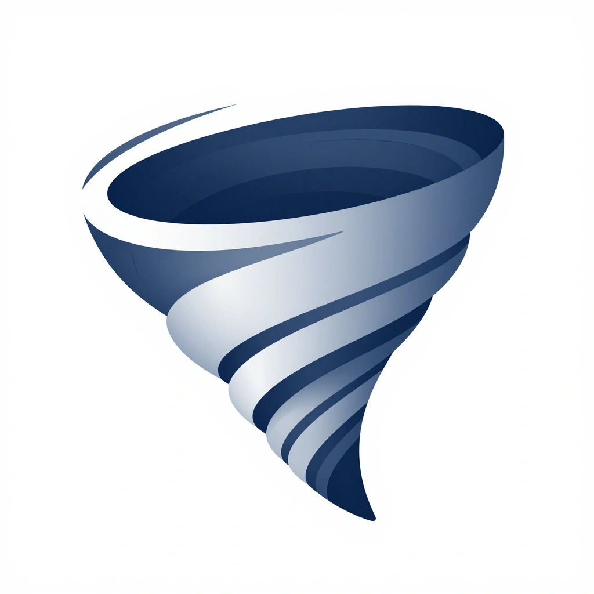

# FugazChat — Mensajería E2EE efímera y segura



> **WindChat** es una solución de mensajería web instantánea con cifrado extremo a extremo (E2EE).
> Se ejecuta en **tu propio PC** como un servidor efímero: nada se almacena, nada se guarda.
> Cuando cierras el servidor, todo desaparece.

La rama `feature/chat-enhancements` empaqueta el cliente web como **FugazChat**, una
app de escritorio (Tauri 2 / WebView2): un solo instalable `.exe` que arranca el relay
Rust y el túnel Cloudflare incrustados — **cero terminales**.

[](https://ko-fi.com/alastor78)

---

## Tabla de Contenidos

- [Resumen Ejecutivo](#resumen-ejecutivo)
- [Características Técnicas](#características-técnicas)
- [Arquitectura del Sistema](#arquitectura-del-sistema)
- [Especificación Criptográfica](#especificación-criptográfica)
- [Instalación y Configuración](#instalación-y-configuración)
- [Cliente Desktop (FugazChat / Tauri)](#cliente-desktop-fugazchat-tauri)
- [Pruebas y Validación](#pruebas-y-validación)
- [Seguridad y Auditoría](#seguridad-y-auditoría)
- [Limitaciones Conocidas](#limitaciones-conocidas)
- [Roadmap y Desarrollo Futuro](#roadmap-y-desarrollo-futuro)
- [Contribución y Licencia](#contribución-y-licencia)

---

## Resumen Ejecutivo

FugazChat (WindChat) proporciona un canal de comunicación bidireccional con las siguientes garantías:

- **Confidencialidad absoluta**: los mensajes se cifran en el cliente con AES-256-GCM antes de salir.
- **Autenticación criptográfica**: cada mensaje lleva un GCM Authentication Tag (128 bits) que garantiza integridad.
- **Zero-knowledge**: el servidor (relay) **nunca** puede leer el contenido. Solo reenvía blobs cifrados.
- **Forward secrecy por mensaje**: ratchet simétrico (HMAC-SHA256) deriva una clave única por mensaje; la chain key anterior se sobrescribe con ceros.
- **Verificación anti-MITM (SAS)**: safety number derivado de ambas claves públicas + roomId; comparable out-of-band.
- **⚠️ Persistente parcial en cliente**: *ephemeral* en el wire/relay (nada se guarda en el servidor), pero el **cliente** persiste en `localStorage` hasta "Salir": previews de mensajes (texto previamente descifrado), contactos, perfil, safety numbers y metadatos de conexión (timestamps, roomId, tamaño de archivos). El contenido cifrado (**ciphertext, claves privadas, claves de sesión**) **nunca** toca `localStorage` — solo el texto ya descifrado de previews. Ver `docs/architecture/PRIVACIDAD.md`.
- **Desktop first**: un instalable `.exe` (Tauri) que incluye relay Rust + cloudflared, sin depender de terminales.

### Casos de uso

- Comunicación confidencial entre dos partes.
- Intercambio de información sensible sin dejar huella en el servidor.
- Entornos con requisitos de privacidad (GDPR, HIPAA).
- Prototipado de sistemas de mensajería segura.

---

## Características Técnicas

### Seguridad

| Componente | Implementación | Norma |
|---|---|---|
| Cifrado simétrico | AES-256-GCM | NIST FIPS 197, NIST SP 800-38D |
| Intercambio de claves | ECDH P-256 (`secp256r1`) | NIST FIPS 186-4, RFC 6090 |
| Derivación de claves | HKDF-SHA-256 | RFC 5869 |
| Vector de inicialización | 96 bits aleatorios (`crypto.getRandomValues`) | NIST SP 800-38D |
| Autenticación | GCM Authentication Tag (128 bits) | NIST SP 800-38D |
| Ratchet simétrico | HMAC-SHA256 (forward secrecy por mensaje) | — |
| SAS anti-MITM | Safety number de ambas claves públicas + roomId | — |
| Rate limiting | 10 msg/s por conexión + límite de joins | — |

### Infraestructura

- **Backend local**: relay Rust nativo (`relay-rust/`, `tokio-tungstenite`) como sidecar en el `.exe`.
- **Backend web**: Node.js + Express + `ws` (referencia, en `server/`).
- **Frontend**: TypeScript, Vite, Web Crypto API nativa.
- **Desktop**: Tauri 2 (WebView2), Job Object de Windows para limpiar sidecars.
- **Protocolo**: WebSocket sobre TLS (`wss://` en prod; `ws://127.0.0.1:8080` para el relay local).
- **Arquitectura**: monorepo con npm workspaces.
- **Testing**: Vitest (94 tests / 14 archivos) + E2E contra relay Rust.

### Rendimiento

- **Latencia de cifrado**: < 5 ms por mensaje (promedio).
- **Tamaño de bundle**: ~1.34 MB JS (435.5 kB gzipped) — incluye KaTeX, highlight.js, marked, DOMPurify. Aceptable para Tauri desktop; el code-splitting está pendiente para la PWA web.
- **Capacidad**: 2 usuarios por sala (diseño intencional).
- **Límite de mensaje**: 10 MB por defecto (configurable).

---

## Arquitectura del Sistema

### Estructura del proyecto

```
windchat/
├── client/          TS + Vite (app web/PWA). 21 módulos src + 14 archivos de test (94 tests)
├── server/          Node + Express + ws (relay "tonto" de referencia)
├── shared/          protocol.ts — FUENTE ÚNICA DE VERDAD (sincronizado a client/server)
├── relay-rust/      Rust + tokio-tungstenite (relay nativo, sidecar en .exe)
├── desktop/         Tauri 2 (launcher Windows, Job Object para matar sidecars)
├── tools/           e2e_server.cjs, link_launcher, scripts de integración (13 scripts)
├── docs/            documentación estructurada (architecture/, desktop/, ops/, ...)
├── FugazChatDesktop.md   (→ docs/desktop/) Roadmap desktop
├── run_chat.bat         Lanzador web en 2.º plano (sin ventanas de terminal)
├── stop_chat.bat        Detiene server relay (POST /quit)
└── package.json         Monorepo workspace (npm workspaces)
```

**Protocolo:** `shared/protocol.ts` es la única fuente de verdad. `npm run sync:protocol` genera
copias en `client/src/protocol.ts` y `server/src/protocol.ts`. Verificado con `npm run check:protocol`.

### Flujo de comunicación

```
┌───────────┐                   ┌─────────┐                   ┌───────────┐
│ Cliente A │   1. P-256 keys   │  Relay  │   2. P-256 keys   │ Cliente B │
│           │ ─────────────────►│ (ws/tcp)│ ◄──────────────── │           │
│           │   3. pubKey swap  │ (ciego) │   3. pubKey swap  │           │
│           │ ◄────────────────►│           │ ◄──────────────── │           │
│           │   5. ECDH+HKDF   │           │   5. ECDH+HKDF    │           │
│           │   6. AES-GCM     │           │                   │           │
│           │ ──ciphertext──►  │           │                   │           │
│           │                  │ ────────► │                   │           │
│           │                  │  blind    │ ────────► │           │
│           │                  │  relay    │           │   8. descifra│
│           │                  │           │           │   AES-GCM    │
└───────────┘                  └───────────┘           └───────────┘
```

**Principio fundamental**: el relay actúa como un intermediario opaco. Solo conoce
metadatos de conexión (timestamp, tamaño, roomId) pero **nunca** el contenido.
El E2EE (incluido el ratchet y el SAS) se negocia entre los dos clientes.

---

## Especificación Criptográfica

### Primitivas

| Componente | Algoritmo | Detalles |
|---|---|---|
| Intercambio de claves | ECDH P-256 (`secp256r1`) | Curva de 256 bits, Web Crypto API nativa |
| Derivación de claves | HKDF-SHA-256 | Sal = `hash(roomId)`. Salida 256 bits para AES-256. |
| Cifrado simétrico | AES-256-GCM | Contador autenticado como AAD (tampering → fallback tag failure). |
| IV | 96 bits aleatorios | `crypto.getRandomValues()`, nunca reutilizado. |
| Ratchet simétrico | HMAC-SHA256 | `messageKey = HMAC(chainKey, 0x01)`, `nextChain = HMAC(chainKey, 0x02)`. Chain key anterior → ceros. |
| SAS | Safety number | Derivado de ambas claves públicas + roomId (orden canónico). |

### Fases

1. **Establecimiento**: cada cliente genera un par ECDH P-256 y envía la clave pública al relay.
2. **Derivación**: ECDH + HKDF-SHA256 → AES-256 key. El relay **nunca** participa.
3. **Cifrado**: IV aleatorio por mensaje; contador autenticado como AAD de GCM.
4. **Transmisión**: paquete `{iv, ciphertext}` → relay ciego → receptor.

### Garantías

- **Confidencialidad**: AES-256.
- **Integridad**: GCM Authentication Tag (128 bits).
- **Forward secrecy**: ratchet simétrico por mensaje; chain key sobreescrita con ceros.
- **Zero-knowledge**: el relay no puede descifrar.
- **SAS anti-MITM**: el safety number detecta un doble handshake del servidor.

---

## Instalación y Configuración

### Requisitos

- Node.js v18+ · npm v8+
- Windows 10/11 (para el `.exe` de Tauri; WebView2 ya está integrado)
- Chrome 90+ / Firefox 88+ / Safari 14+ / Edge 90+ (Web Crypto API)

### Web (servidor Node local)

```powershell
# Primera vez
.\setup.ps1        # o  npm run check:protocol && npm run build

# Arrancar en 2º plano sin terminales (Windows)
.\run_chat.bat     # relay :8080 + server :4183 (oculto)
# Para detenerlo:
.\stop_chat.bat     # POST /quit al server → mata el relay hijo
```

O manualmente:

```bash
# Terminal 1: servidor
cd server && npm run dev        # http://localhost:8081 (referencia; el relay Rust de producción usa :8080)
# Terminal 2: cliente
cd client && npm run dev         # http://localhost:3000
```

Abre `http://localhost:3000`, crea una sala y comparte el Room ID.

### Variables de entorno

```bash
cp .env.example .env
# PORT=8080                 # WebSocket del relay
# LOCAL_HTTPS=true          # TLS local (mkcert)
# MAX_USERS_PER_ROOM=2      # límite por sala
# MAX_MESSAGE_SIZE=10485760 # 10MB
# VERBOSE_LOGS=true          # solo para debug local (OFF por defecto)
```

---

## Cliente Desktop (FugazChat / Tauri)

**Estado:** Fases 0-5 completadas y verificadas (ver [FugazChatDesktop.md](docs/desktop/FugazChatDesktop.md)).

Un único `FugazChat.exe` que, al abrirse, arranca:

- un **relay E2EE en Rust** local (`localhost:8080`),
- la **UI de chat** (el frontend TS actual) en WebView2,
- un botón **"Crear enlace"** que lanza `cloudflared` incrustado → URL `https://*.trycloudflare.com`,
- **auto-actualización** desde GitHub Releases (firma Ed25519, cero telemetría),
- un **launcher auto-reparador** que verifica los sidecars al arranque.

```bash
# Build portable (solo el .exe, práctico para probar)
cd desktop && npm run build:portable

# Build instalable (NSIS/MSI) — requiere NSIS + WiX en el PATH
cd desktop && npm run build
```

> El relay Rust mantiene el **protocolo idéntico** a `shared/protocol.ts`. Verificado por
> `relay-rust/verify_relay.js` y `cargo test` (eco + senderId + no-rehandshake-en-reconexión).

---

## Pruebas y Validación

### Suite automatizada

```bash
npm test                       # check:protocol + vitest (94/94)
cd client && npm run test:ui   # UI interactiva
cd client && npm run test:coverage
```

**Categorías (94 tests, 14 archivos):**

| # | Categoría | Archivo | Qué valida |
|---|---|---|---|
| 1 | Criptográfica | `crypto.test.ts` | ECDH, HKDF, AES-GCM, IV uniqueness, ratchet FS |
| 2 | Integración | `integration.test.ts` | Handshake completo + intercambio de claves |
| 3 | WebSocket | `websocket.test.ts` | Conexión, reconexión (exponential backoff), room limit |
| 4 | E2E | `e2e_*.test.ts` | Reconexión con ratchet, diagnóstico, share link |
| 5 | Store/sync | `store/sync.test.ts` | localStorage + export/import cifrado de perfil+contactos |
| 6 | Relay Rust | `relay-rust/` | `cargo test`: eco + senderId + no-rehandshake |

### Checklist manual

- [x] Room ID generado y mostrado
- [x] Botón "Copiar Room ID"
- [x] Mensajes propios a la derecha, del peer a la izquierda
- [x] Timestamps precisos
- [~] Indicador "typing..." (parcial)
- [x] Temas light/dark/cyberpunk
- [x] Notificaciones y sonido
- [x] Multi-chat (N salas simultáneas)
- [x] Contactos + safety number (SAS)
- [x] Perfil (nombre, color, foto, estado)
- [x] Sync offline (código cifrado)
- [x] Adjuntos (imágenes estilo WhatsApp, videos, documentos ≤50 MB)
- [x] Reacciones (emoji picker) + reply
- [x] Acuses de recibo (receipts)
- [ ] Responsive móvil (WIP)

---

## Seguridad y Auditoría

### Modelo de amenazas

| Amenaza | Mitigation | Estado |
|---|---|---|
| **MITM** | ECDH + WSS + **SAS comparado out-of-band** | Solo si el usuario compara el safety number |
| **Tampering** | GCM Authentication Tag | ✅ Mitigada |
| **Replay** | IV único por mensaje + timestamp | ✅ Mitigada |
| **Brute force** | AES-256 (2^256) | ✅ Mitigada |
| **Compromiso del servidor** | Zero-knowledge + SAS detecta key substitution | ✅ Mitigada |
| **Path traversal** | `express.static` con normalización | ✅ Mitigada |
| **XSS** | Markdown sanitizado (3 capas: marked → DOMPurify → regex custom). `textContent` para contenido dinámico | ✅ Mitigada |
| **Timing attacks** | GCM constant-time | ✅ Mitigada |
| **DoS (oversized msgs)** | Size checked antes de `JSON.parse` + rate limiting | ✅ Mitigada |

> **Nota sobre MITM:** el servidor distribuye las claves públicas. Un servidor malicioso
> puede intentar un doble handshake. Lo que detiene es el **safety number**: cada lado lo
> deriva de ambas claves públicas, así que una intercepción produce códigos diferentes.
> **Solo protege si ambos usuarios comparan el código** por otro canal (voz, presencial).

### Auditorías realizadas

- `docs/audit/AUDITORIA_REPORTE.md` — análisis estático (crypto, reconnect, sanitización, relay).
- `docs/audit/AUDITORIA_UI.md` — revisión de markup, CSS, lógica de presentación.

### Recomendaciones

1. Usar HTTPS/WSS en producción (Web Crypto API requiere contexto seguro).
2. No compartir el Room ID públicamente (es el secreto de la sala).
3. Verificar el safety number out-of-band al iniciar.
4. Usar dispositivos de confianza (el endpoint es el mayor riesgo).
5. No esperar persistencia: los mensajes son efímeros en el relay.

---

## Limitaciones Conocidas

| Limitación | Descripción | Impacto | Roadmap |
|---|---|---|---|
| **Sin identidad persistente** | Los peers son anónimos por sesión | MITM si no se compara el SAS | ✅ SAS; v2.0: TOFU |
| **Metadata visible** | El servidor ve timestamps, tamaño, patrones | Análisis de tráfico posible | Mitigación parcial con padding |
| **Max 2 usuarios** | Límite por sala (diseño) | Sin chats grupales | v2.0: group chats |
| **Ephemeral parcial** | El relay no persiste, pero `localStorage` retiene previews + metadatos hasta "Salir" | Metadatos locales persisten | Diseño actual; aclarado |
| **PWA parcial** | El SW y manifest.json no están incluidos en el build (referencias con pre-check) | No instalable como PWA | Pendiente |
| **Bundle grande** | 1.34 MB JS sin code-splitting | Lento en web PWA | Vite `manualChunks` |
| **Responsive móvil** | WIP | Layout no optimizado en móvil | Futuro |

---

## Roadmap y Desarrollo Futuro

### v2.0 (Q2-Q3 2026)

**Alta prioridad:**
- [x] Forward secrecy por mensaje (ratchet HMAC-SHA256)
- [x] Verificación SAS out-of-band
- [ ] Persistencia local (IndexedDB cifrada; MVP: localStorage)
- [x] Adjuntos cifrados (imagen/video/docs ≤50 MB)
- [x] Rate limiting (10 msg/s por conexión)

**Media prioridad:**
- [x] Acuses de recibo (delivered/read)
- [x] Reacciones (emoji picker)
- [x] Reply a mensajes
- [ ] Notificaciones push (Service Worker; PWA parcial)
- [ ] Chats grupales (3-10 participantes)

**Prioridad menor:**
- [ ] WebRTC P2P (modo sin relay)
- [ ] Videollamadas encriptadas
- [ ] Temas avanzados (cyberpunk azul parcial)
- [ ] Bot API

### v3.0 (2027+)

- [ ] Escalado horizontal (Redis)
- [ ] App nativa (Electron/RN)
- [ ] Autenticación de usuario (opcional)

---

## Contribuir y Licencia

1. **Fork** el repositorio
2. **Crear rama**: `git checkout -b feature/nueva-funcionalidad`
3. **Commit**: `git commit -am 'Descripción breve'`
4. **Push** a tu fork
5. **Pull Request** con descripción detallada

**Directrices:** sigue el estilo de código existente, añade tests, actualiza docs, usa commits descriptivos en ES o EN.

### Áreas de contribución

- **Seguridad**: reportes de vulnerabilidades (GitHub Security Advisories)
- **Código**: nuevas funcionalidades, fixes, optimizaciones
- **Documentación**: mejoras en README, guías, tutoriales
- **Testing**: nuevos tests, mayor cobertura
- **Diseño**: mejoras UI/UX
- **Traducciones**: internacionalización

### Licencia

**GNU Affero General Public License v3.0 (AGPL-3.0)**

Copyright (c) 2026 WindChat Contributors

Distribuido bajo AGPL v3.0. Si lo ofreces como servicio, también debes poner a disposición el código fuente modificado.

- https://www.gnu.org/licenses/agpl-3.0.html
- https://www.gnu.org/licenses/agpl-3.0.txt

### Información del proyecto

- **Inicio:** marzo 2026
- **Versión actual:** v2.0 (feature branch `feature/chat-enhancements`)
- **Stack:** Node.js, TypeScript, Web Crypto API, WebSocket, Vite, Rust (relay), Tauri 2 (desktop)
- **Licencia:** GNU AGPL v3.0
- **Mantenedor:** [@LordAlastor78](https://ko-fi.com/alastor78)
- **Propósito:** implementación de referencia de E2EE con zero-knowledge, priorizando simplicidad, transparencia y seguridad criptográfica moderna.

---

> El renombrado a **FugazChat** + tema estelar es el objetivo de este roadmap
> ([docs/desktop/FugazChatDesktop.md](docs/desktop/FugazChatDesktop.md)). El build actual usa
> los nombres `WindChat`/`FugazChat` según `productName` en `desktop/src-tauri/tauri.conf.json`.
